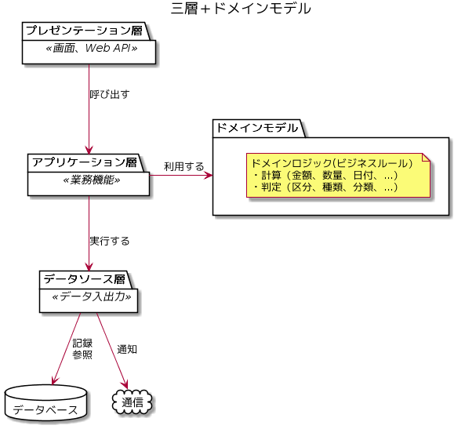
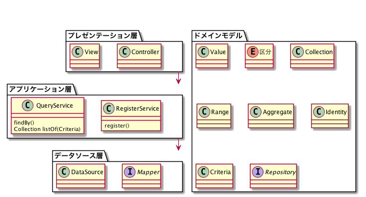

# JIG

JIGはコードでの設計を支援するツールです。思い浮かんだ設計をコーディングすればいい感じに可視化される世界を目指しています。

主にバイトコード（classファイル）から一覧や図を出力します。バイトコードが対象なので、JVM言語であれば主要機能は動作します。

## サンプル
[サンプルリポジトリ](https://github.com/dddjava/jig-sample) を参照してください。

## 使い方

実行方法はコマンドラインとGradleプラグインがあります。それぞれのREADMEを参照してください。

- [コマンドラインでの使い方](./jig-cli)
- [Gradleプラグインでの使い方](./jig-gradle-plugin)

実行には Java17以降 と [Graphviz](https://www.graphviz.org/) が必要です。
より詳しい情報は[Wiki](https://github.com/dddjava/jig/wiki)を参照してください。
うまく動かない場合などは [issue](https://github.com/dddjava/jig/issues/new/choose) でお問い合わせください。

## コンセプト

三層＋ドメインモデルのアーキテクチャで実装されたコードから、以下の分析・設計情報を生成します。

- ドメインモデルのクラスに記述された業務の概念とビジネスルール
- アプリケーション層に記述された業務機能

### 想定するアーキテクチャ

三層＋ドメインモデルのアーキテクチャでの使用を想定しています。

## JIGドキュメント

JIGの生成する分析・設計情報をJIGドキュメントと呼んでいます。

- 種類は [JigDocument](./jig-core/src/main/java/org/dddjava/jig/domain/model/documents/documentformat/JigDocument.java) を参照してください。
- サンプルは [JIGのドッグフーディング](https://dddjava.github.io/jig/) を参照してください。

## LICENSE

[Apache License 2.0](LICENSE)
